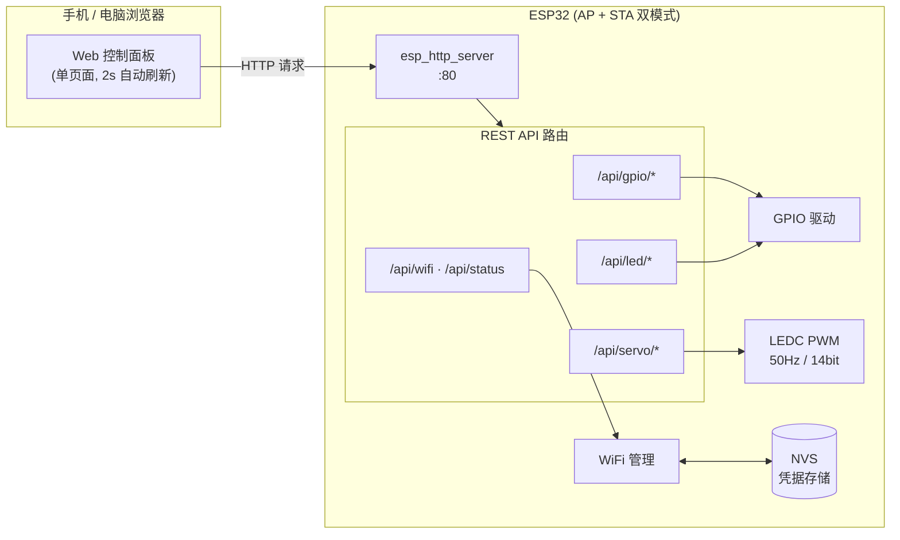

<div align="center">

# ESP32 Web Control Panel

### 一块 ESP32，一个网页，掌控你的所有硬件

*WiFi 配网 · GPIO 控制 · 舵机 PWM · 无需 App · 开箱即用*


</div>

---

## 项目简介

把一块 ESP32 变成一个自带 Web 服务器的物联网控制中心：

- 上电后自动开启配网热点，手机连上即可在浏览器里完成 WiFi 配置
- 连接路由器后，局域网内任意设备打开网页即可远程控制
- 支持 GPIO 读写、最多 8 路舵机、板载 LED，全部通过 REST API 驱动
- 凭据持久化于 NVS，断电重启自动重连，配网热点始终可用

无需云端、无需注册、无需安装任何 App。

## 系统架构



## 功能一览

| 模块 | 功能 | 说明 |
|------|------|------|
| 📶 WiFi 配网 | AP + STA 双模式 | 热点 `ESP32-Control` 始终可用，扫描周边 AP 一键选择 |
| 💾 凭据持久化 | NVS 存储 | 断电不丢失，启动自动重连，保存即时生效无需重启 |
| 🔌 GPIO 控制 | 输出/输入/高/低/翻转 | 网页下拉选脚，实时状态回显 |
| 🦾 舵机控制 | 最多 8 路 | LEDC 硬件 PWM，50Hz，0.5~2.5ms 标准脉宽，滑块 0°~180° |
| 💡 板载 LED | 开关控制 | GPIO2 直驱 |
| 📊 系统状态 | 实时监控 | IP 地址、运行时长、剩余堆内存、已配置设备列表 |

## 快速开始

### 1. 硬件准备

- ESP32 开发板（DevKit 等常见板型均可）
- （可选）舵机 × N，信号线接任意可用 GPIO

### 2. 编译烧录

```bash
# 安装 ESP-IDF v5.5.1 后执行
idf.py set-target esp32
idf.py build flash monitor
```

### 3. 配网

```
1. 手机连接热点  ESP32-Control  （密码：12345678）
2. 浏览器打开    http://192.168.4.1
3. 点击「WiFi 配网设置」→ 扫描 → 选择你家 WiFi → 输入密码 → 保存并连接
4. 串口打印设备 IP 后，同一局域网内访问 http://<设备IP> 即可控制
```

## REST API

| 方法 | 路径 | 说明 |
|------|------|------|
| `GET`  | `/` | 控制面板主页 |
| `GET`  | `/wifi` | WiFi 配网页面 |
| `GET`  | `/api/wifi/scan` | 扫描周边 AP，返回 JSON 数组 |
| `POST` | `/api/wifi` | 保存并立即连接 `{ssid, password}` |
| `GET`  | `/api/status` | 系统状态 + 已配置设备列表 |
| `POST` | `/api/gpio/<pin>/mode/output` | 设为输出模式 |
| `POST` | `/api/gpio/<pin>/mode/input` | 设为输入模式 |
| `POST` | `/api/gpio/<pin>/high` | 输出高电平 |
| `POST` | `/api/gpio/<pin>/low` | 输出低电平 |
| `POST` | `/api/gpio/<pin>/toggle` | 翻转电平 |
| `POST` | `/api/servo/<pin>/<angle>` | 舵机转到指定角度（0~180） |
| `POST` | `/api/led/on` \| `/api/led/off` | 板载 LED 开关 |

示例：

```bash
curl -X POST http://192.168.1.100/api/gpio/4/high        # GPIO4 拉高
curl -X POST http://192.168.1.100/api/servo/18/90        # GPIO18 舵机回中
curl http://192.168.1.100/api/wifi/scan                  # 扫描 WiFi
```

<details>
<summary><b>/api/status 返回示例</b></summary>

```json
{
  "status": "Running",
  "ip": "192.168.1.100",
  "uptime": 3600,
  "heap": 203856,
  "wifi_ssid": "MyHomeWiFi",
  "devices": [
    {"pin": 4,  "type": "GPIO",  "status": "Configured", "value": "HIGH"},
    {"pin": 18, "type": "Servo", "status": "Configured", "value": "90 deg"}
  ]
}
```

</details>

## 可用引脚

网页下拉框中开放的 GPIO：

`2` `4` `12` `13` `14` `15` `16` `17` `18` `19` `21` `22` `23` `25` `26` `27` `32` `33`

> ⚠️ 注意事项
> - **GPIO2** 同时是板载 LED，网页 LED 开关与 GPIO 控制操作的是同一引脚
> - **GPIO12** 为 strapping 引脚，上电状态会影响启动，用作舵机需谨慎
> - GPIO 6~11 连接内部 Flash，不可使用（已从下拉框排除）

## 项目结构

```
esp32_test/
├── main/
│   └── blink_example_main.c    # 全部业务：网页 UI + REST API + 硬件驱动
├── CMakeLists.txt
├── sdkconfig                   # ESP-IDF 项目配置
└── README.md
```

## 踩坑记录

开发过程中真实遇到并解决的问题，供同类项目参考：

<details>
<summary><b>1. esp_http_server 通配符路由 404</b></summary>

IDF 的 `httpd_uri_match_wildcard` **只支持结尾通配符**：源码中先检测模板末尾的 `*`，然后仅对前缀做 `strncmp`。写成 `/api/gpio/*/high` 时中间的 `*` 会被当作字面字符，永远匹配不上。

✅ 解决方案：注册 `POST /api/gpio/*`，在 handler 内解析 URI 段后分发到各子处理器。

</details>

<details>
<summary><b>2. 注册处理器报 no slots left</b></summary>

`HTTPD_DEFAULT_CONFIG()` 的 `max_uri_handlers` 默认只有 **8**，超出部分静默注册失败，请求时 404。

✅ 解决方案：`config.max_uri_handlers = 20;`

</details>

<details>
<summary><b>3. wifi_config.sta.ssid 赋值编译错误</b></summary>

`ssid`/`password` 是**字节数组**而非指针，不能用三元表达式赋字符串地址，否则 `int-conversion` 错误 + `-Werror` 编译失败。

✅ 解决方案：结构体初始化后用 `strlcpy()` 拷贝进数组。

</details>

<details>
<summary><b>4. 普通 LED 无法通过 WS2812 驱动点亮</b></summary>

blink 示例的 `led_strip` 组件走 RMT 发送 WS2812 协议（数据脚由 `CONFIG_BLINK_GPIO` 指定）。板载如果是普通 LED，协议完全对不上，怎么调都不亮。

✅ 解决方案：普通 LED 直接 `gpio_set_level()` 驱动。

</details>

<details>
<summary><b>5. 首次启动卡在连接假 AP</b></summary>

NVS 无凭据时若仍调用 `esp_wifi_connect()`，会向空 SSID 发起重试，白白阻塞配网流程。

✅ 解决方案：仅当 `saved_ssid[0] != '\0'` 时才发起连接，无凭据直接进入配网模式。

</details>

## Roadmap

- [x] WiFi AP+STA 配网（扫描 / 一键连接 / NVS 持久化）
- [x] GPIO 输入输出控制
- [x] 多路舵机 PWM（自动分配 LEDC 通道）
- [x] 板载 LED 控制
- [ ] WebSocket 实时推送（替代 2s 轮询）
- [ ] mDNS 支持（`http://esp32.local` 访问）
- [ ] OTA 固件升级
- [ ] PWM 调光接口
- [ ] 传感器数据接入（DHT22 等）

## 技术栈

| 层级 | 技术 |
|------|------|
| 框架 | ESP-IDF v5.5.1 (FreeRTOS) |
| 语言 | C (gnu17) |
| HTTP 服务 | esp_http_server（尾部通配符路由 + 内部分发） |
| 网络 | esp_wifi APSTA 双模式 |
| PWM | LEDC 14bit @ 50Hz |
| 存储 | NVS |
| 前端 | 原生 HTML/CSS/JS 单页面，raw literal 内嵌，零依赖 |

---

<div align="center">

**用一块 ESP32，点亮你的第一个物联网项目**

如果这个项目对你有帮助，欢迎点个 Star

</div>
